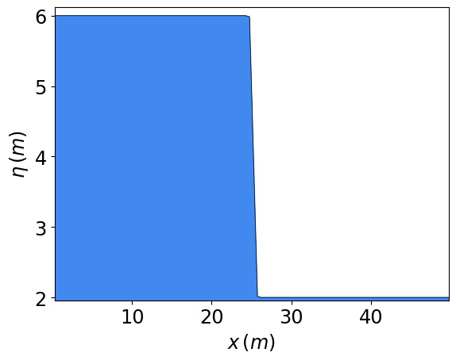
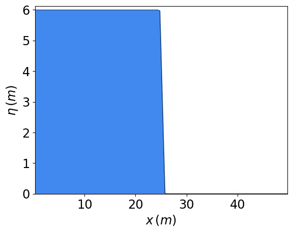
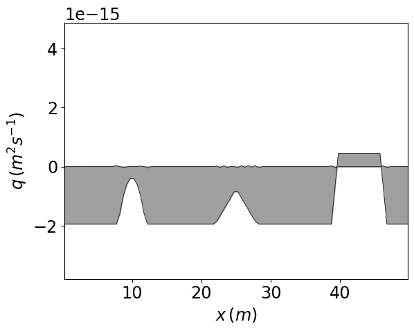
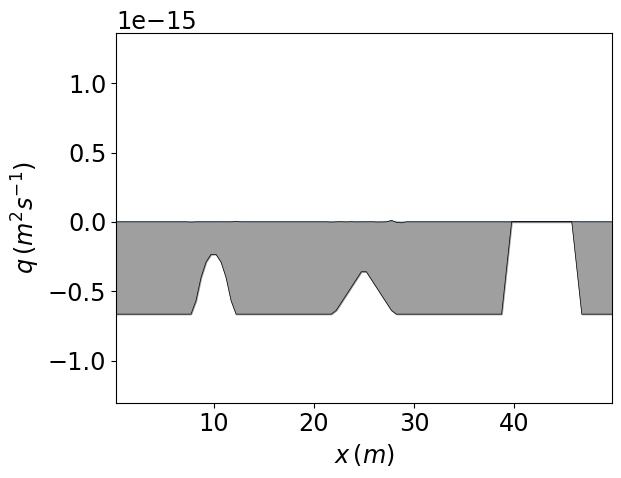

# fv1-cpp

## About

This project is a model that can simulate one-dimensional shallow water flow by numerically solving the [shallow water equations](https://en.wikipedia.org/wiki/Shallow_water_equations).

To use this model, you need to have CMake if on Linux, and Visual Studio 2019 or higher if on Windows. Whether on Linux or Windows, you also need to have Python as well as the following packages installed:

- `pandas`
- `numpy`
- `matplotlib`
- `imageio`

## Building the model executable

### On Linux

From the command line, go to the `fv1-cpp` directory. Inside this directory run the following commands:

`cmake -S . -B build`
`cmake --build build`

These commands will build the executable in `fv1-cpp/build`.

### On Windows

Open the folder `fv1-cpp` in Visual Studio and go to toolbar at the top. In the toolbar, select either the `x64-Debug` or `x64-Release` option from the dropdown menu. After selecting an option, from the toolbar click `Build > Rebuild All`.

Depending on whether the `x64-Debug` or `x64-Release` option was selected, the built executable will be located in `fv1-cpp\out\build\x64-Debug` or `fv1-cpp\out\build\x64-Release` respectively.

## Running the model

Whether on Linux or Windows, go to the `fv1-cpp` directory/folder in the command line, type in `python test.py` or `python3 test.py` and press enter to see further instructions on how to run the model.

## In-built test cases

The model supports 6 in-built tests. The outputs from each test are shown in the animations below. The animations can be used to check for correctness if the model is modified in any way. 

### Wet dam break

### Dry dam break

### Dry dam break with friction

### Wet c-property

### Wet/dry c-property

### Building overtopping

